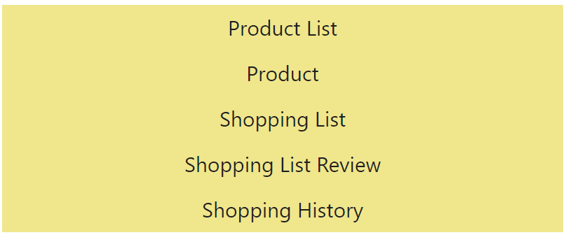
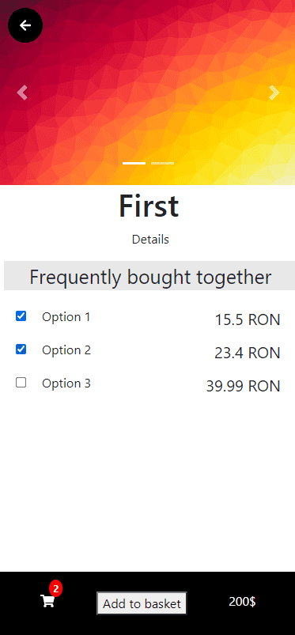
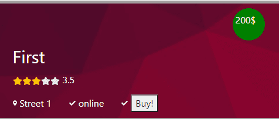

### Project description:
*mproducts* is a mobile application, developed with React Native.

### Contribution:
Worked on all UI components.

It manages products and allows the user to buy one or more products.

Also provides information about a product such as rating, location and so on.

### Link to source code: 
closed source.
