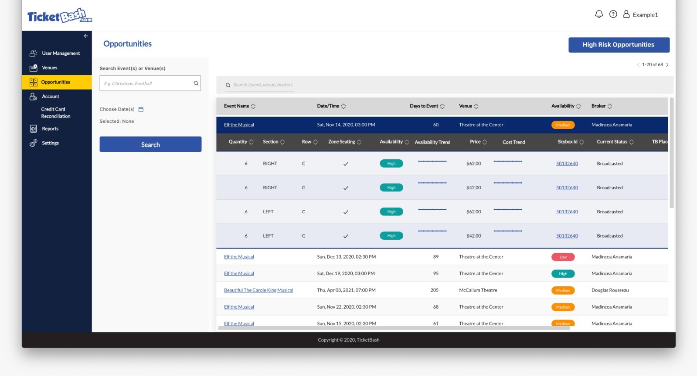
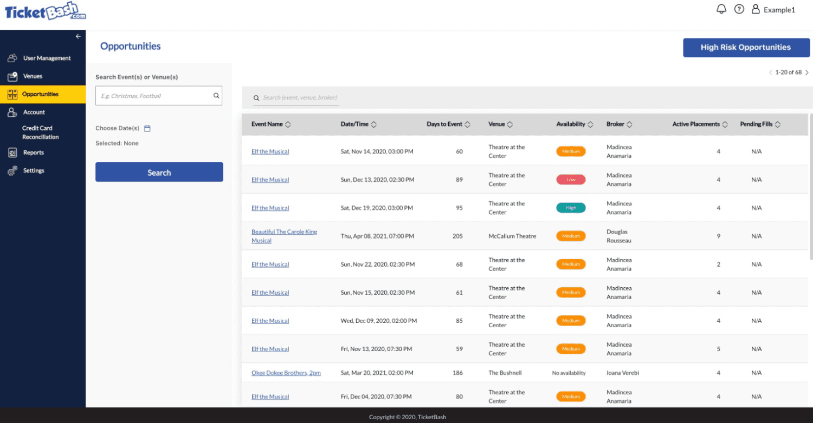
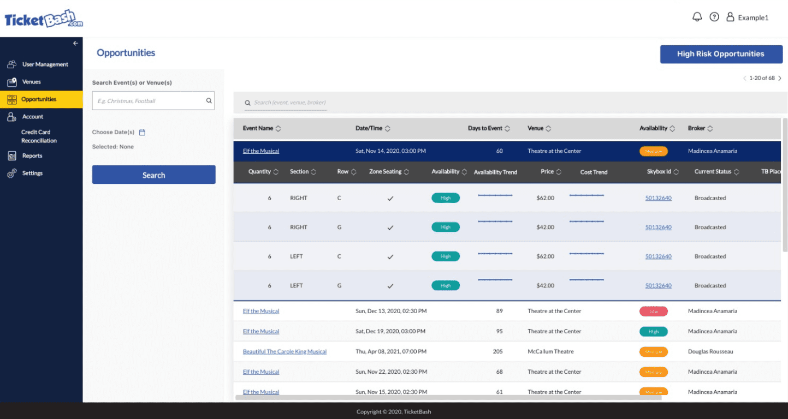
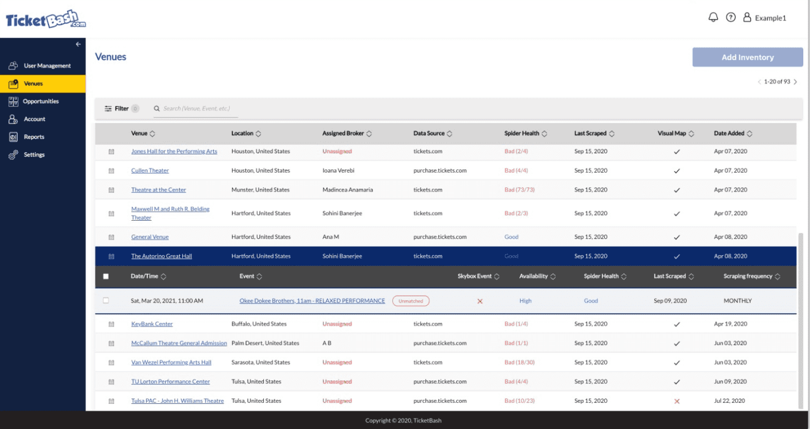

Project description: Event trading platform. 
Scrapes event data to find show availability and allows making placements on secondary market places.

Contribution: I worked on the UI components for making placements, showing venue data, placement reporting.

Link to source code: closed source.
